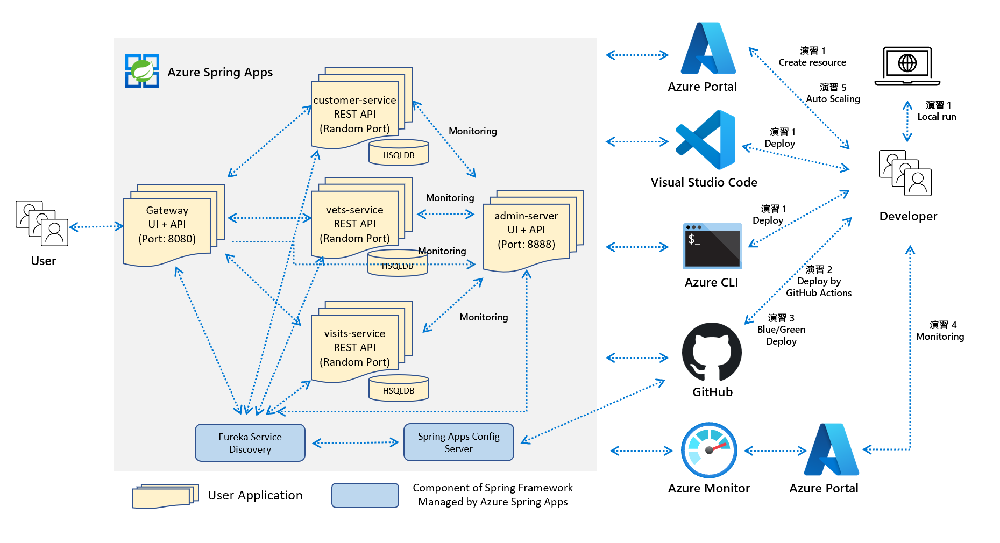

# 「触ってわかる Java on Azure Spring Apps」ハンズオン セミナー

## 目標
このハンズオンを完了すると、参加者が本ハンズオンで得たAzure Spring Appsの知識をご自身のアプリケーションに応用できるようになります。 

## 対象となるお客様
- アプリケーション開発者
- インフラストラクチャ アーキテクト

## 全体概要

- **演習 1 アプリケーションのローカル実行と Azure へのデプロイ**

	1. ローカル環境で Java Spring Boot アプリケーションの実行
	1. Azure リソースを作成
	1. Visual Studio Code を使用したアプリケーションのデプロイ
   	1. Azure CLI を使用したアプリケーションのデプロイ
   
     

- **演習 2 GitHub Actions を使用したアプリケーションのデプロイ**

	1. GitHub Actions 雛形を作成
	1. アプリのコンパイルジョブ追加
	1. Azure 接続処理を追加
	1. アプリをデプロイする処理を追加
	1. CI/CD を体験
    
     
## アーキテクチャ

- **アーキテクチャ図**

    
 

## 事前準備

1. [事前準備](./steps/Common.md)

## 操作手順

- **演習 1**
	1. [ローカル環境で Java Spring Boot アプリケーションの実行](./steps/P1-01.md)
	1. [Azure リソースを作成](./steps/P1-02.md)
	1. [Visual Studio Code を使用したアプリケーションのデプロイ](./steps/P1-03.md)
	1. [Azure CLI を使用したアプリケーションのデプロイ](./steps/P1-04.md)
 
     

- **演習 2**
	1. [GitHub Actions 雛形を作成](./steps/P2-01.md)
	1. [Deploy ジョブを追加](./steps/P2-02.md)
	1. [Azure 接続処理を追加](./steps/P2-03.md)
	1. [Azure Spring Apps にアプリをデプロイする処理を追加](./steps/P2-04.md)
	1. [CI/CD を体験](./steps/P2-05.md)

     

- **リソースの削除 (Option)**

	このハンズオンで作成した Azure リソースのプロビジョニングを解除する場合は、以下の手順を実施してください。

  1. すべての Azure ソース グループを削除

	- ポータルからリソース グループのブレードに移動し、画面上のコマンド バーで `[Delete (削除)]` を選択
	- リソース グループの名前を再度入力して `[Delete (削除)]` を選択し、削除の確認

1. 「演習 2」の「3. Azure 接続処理を追加」で作成したサービス プリンシパルを削除

 

---
## LICENSE

このドキュメントに記載されている情報 (URL や他のインターネット Web サイト参照を含む) は、将来予告なしに変更することがあります。別途記載されていない場合、このソフトウェアおよび関連するドキュメントで使用している会社、組織、製品、ドメイン名、電子メール アドレス、ロゴ、人物、場所、出来事などの名称は架空のものです。実在する商品名、団体名、個人名などとは一切関係ありません。お客様ご自身の責任において、適用されるすべての著作権関連法規に従ったご使用をお願いいたします。著作権法による制限に関係なく、マイクロソフトの書面による許可なしに、このドキュメントの一部または全部を複製したり、検索システムに保存または登録したり、別の形式に変換したりすることは、手段、目的を問わず禁じられています。ここでいう手段とは、複写や記録など、電子的、または物理的なすべての手段を含みます。

マイクロソフトは、このドキュメントに記載されている内容に関し、特許、特許申請、商標、著作権、またはその他の無体財産権を有する場合があります。別途マイクロソフトのライセンス契約上に明示の規定のない限り、このドキュメントはこれらの特許、商標、著作権、またはその他の知的財産権に関する権利をお客様に許諾するものではありません。

製造元名、製品名、URL は、情報提供のみを目的としており、これらの製造元またはマイクロソフトのテクノロジを搭載した製品の使用について、マイクロソフトは、明示的、黙示的、または法令によるいかなる表明も保証もいたしません。製造元または製品に対する言及は、マイクロソフトが当該製造元または製品を推奨していることを示唆するものではありません。掲載されているリンクは、外部サイトへのものである場合があります。これらのサイトはマイクロソフトの管理下にあるものではなく、リンク先のサイトのコンテンツ、リンク先のサイトに含まれているリンク、または当該サイトの変更や更新について、マイクロソフトは一切責任を負いません。リンク先のサイトから受信した Web キャストまたはその他の形式での通信について、マイクロソフトは責任を負いません。マイクロソフトは受講者の便宜を図る目的でのみ、これらのリンクを提供します。また、リンクの掲載は、マイクロソフトが当該サイトまたは当該サイトに掲載されている製品を推奨していることを示唆するものではありません。

Copyright (c) Microsoft Corporation. All rights reserved.
