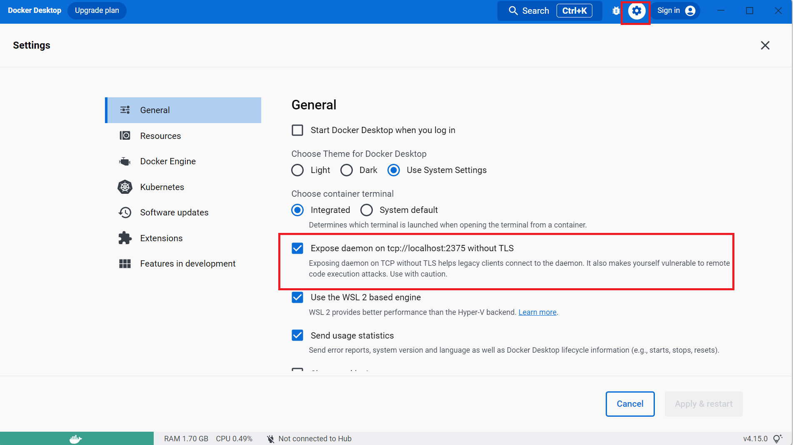
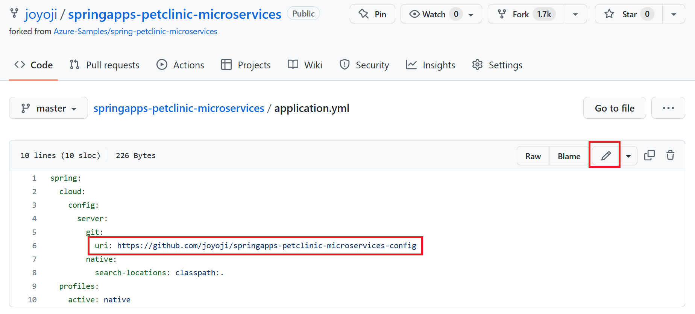
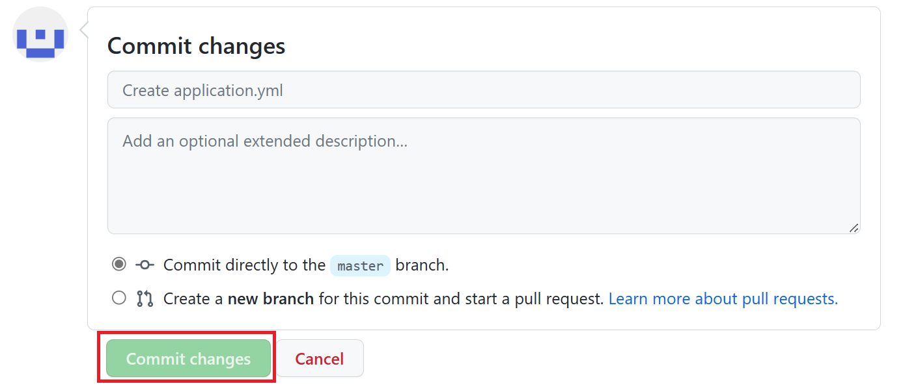
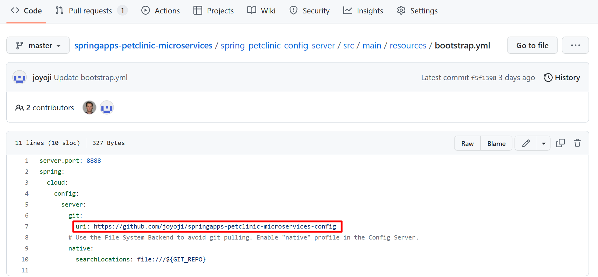
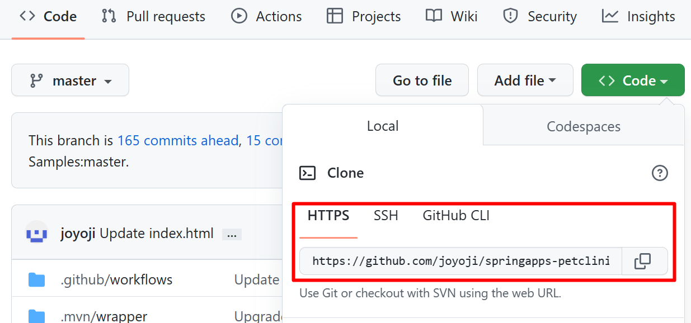

# 事前準備
演習に入る前に準備しておく開発環境の構築や、演習用のプロジェクトの入手について紹介します。
<br><br>

## 1. アカウント
この演習では以下のアカウントが必要です。

お持ちでない場合は以下のリンク先で作成するか、提供されたチケット類がある場合は、提供元からの情報に従いアカウントを作成してください。

   - [**Microsoft Azure**](https://docs.microsoft.com/ja-jp/dotnet/azure/create-azure-account)

   - [**GitHub**](https://github.com/join)

<br>

## 2. ローカル開発環境
この演習で使用する開発環境に必要となるツールとランタイム類は以下のとおりです。

リンク先のドキュメントに従いインストールを行い、正常に動作するようあらかじめセットアップしてください。

   - [**OpenJDK**](https://learn.microsoft.com/ja-jp/java/openjdk/download)

      Ver11.0.17 へ移動、各自 OS に対応するものをダウンロード、https://learn.microsoft.com/ja-jp/java/openjdk/install よりインストール

   - [**Maven**](https://maven.apache.org/download.cgi)

      Windows の場合 

      1. apache-maven-3.8.7-bin.zip をダウンロードし、解凍してローカルに配置　 

      1. Windows の [システムの環境変数] で JAVA_HOME に JAVA SDK のインストールパスを指定 (ex : C:\Program Files\Java\jdk-11.0.14) 

      1. Windows の [システムの環境変数] の path に Maven の以下のパスを設定 

         　配置したディレクトリ\apache-maven-3.8.7\bin 

      MacOS の場合、[**Maven – Installing Apache Maven**](https://maven.apache.org/install.html) をご参考にしてください。 

   - [**Git**](https://git-scm.com/book/ja/v2/%E4%BD%BF%E3%81%84%E5%A7%8B%E3%82%81%E3%82%8B-Git%E3%81%AE%E3%82%A4%E3%83%B3%E3%82%B9%E3%83%88%E3%83%BC%E3%83%AB) 
   
      作業用のコードをダウンロード、コードを管理するための git クライアントとなります。 

      Windows の場合、[**Git for windows**](https://git-scm.com/download/win) よりインストールします。 

      MacOS の場合、[**Git for MacOS**](https://git-scm.com/download/mac) よりインストールします。  

   - Git Bash 

      Windows 向けの Bash エミュレータ。上記の Git for windows に含まれます。  

      MacOS の場合、標準で付属しているターミナルを使用します。 

      ※ 今回のハンズオンには、Git Bash、ターミナル または Windows に標準搭載されている PowerShell を使用してコマンドを実行します。 

   - [**Azure CLI**](https://docs.microsoft.com/ja-jp/cli/azure/install-azure-cli)

      なお Azure CLI のバージョンが古いと動作しないコマンドもありますので、既にインストールされている場合は、以下のドキュメントを参考に更新を行ってください。

      - [**Azure CLI 更新する方法**](https://docs.microsoft.com/ja-jp/cli/azure/update-azure-cli)

      何らかの事情でローカル環境で Azure CLI が使用できない場合は、Azure ポータルから Azure Cloud Shell を使用することができます。

      使い方については以下を参考にしてください。

      - [**Azure Cloud Shell の概要**](https://docs.microsoft.com/ja-jp/azure/cloud-shell/overview)

   - [**Docker デスクトップ**](https://docs.docker.com/get-docker/) (※) 演習でローカルでのコンテナ アプリ実行用

      ロカール環境で Docker コンテナを実行する際、Maven Docker Plugin より接続エラーを回避するために、以下の設定を行います。

      1. Docker Desktop を起動して、右上歯車のアイコン( Setting )画面を開きます。

      2. デフォルトで表示されている General 画面に、`Expose daemon on tcp://localhost:2375 without TLS` にチェックをいれて、 `Apply & restart` ボタンをクリックして保存します。

         

   - [**Visual Studio Code**](https://code.visualstudio.com/Download)

      Visual Studio Code 拡張

      - [**Azure Resources**](https://marketplace.visualstudio.com/items?itemName=ms-azuretools.vscode-azureresourcegroups)
      - [**Azure Spring Apps**](https://marketplace.visualstudio.com/items?itemName=vscjava.vscode-azurespringcloud)

<br>

## 3. 演習で使用するプロジェクトの入手
このハンズオンでは、ペット クリニックを模したサービスを使用します。同サービスはマイクロサービス アーキテクチャ パターンで開発されています。

サービスは 5 つのコア Spring アプリに分解されます。個別にもデプロイことが可能です。

   - 顧客サービス: 一般的なユーザー入力ロジックと検証が含まれています。ペットと飼い主の情報 (名前、住所、市区町村、電話番号) が含まれます。
   - 訪問サービス: 各ペットのコメントの訪問情報を保存および表示します。
   - 獣医サービス: 名前や専門分野など、獣医の情報を保存および表示します。
   - API ゲートウェイ: システムへの単一のエントリ ポイントです。要求を処理し、適切なサービスにルーティングしたり、複数のサービスを呼び出し、結果を集計したりするために使用されます。
   - Admin: Spring アプリケーションを監視します。
    
3 つのコア サービスは、外部 API をクライアントに公開します。

ソースコードは以下となります。

[**springapps-petclinic-microservices**]( https://github.com/MSKK-Div2-App-Innovation/springapps-petclinic-microservices ) 本体部分のリポジトリ

[**springapps-petclinic-microservices-config**]( https://github.com/MSKK-Div2-App-Innovation/springapps-petclinic-microservices-config ) 全て分散アプリケーションのプロパティを管理するためのリポジトリ

<br>

### 3.1 リポジトリのコピー

- **サービス本体部分**
    1. 以下の URL にアクセスし、画面内の右上のボタン `[Fork]` をクリックします。
      https://github.com/MSKK-Div2-App-Innovation/springapps-petclinic-microservices  
      <br>
    
    2. `[+ Create a new fork]` を選択し、画面の各項目を以下のように設定します
      
         |  項目  |  値  |
         | ---- | ---- |   
         | Owner * | 自身のアカウント |
         | Repository name * | springapps-petclinic-microservices |
         | Description (Optional) | 任意の説明 |
         | Copy the master branch only | チェック|

   <br>
    
    3. 同ページの `[Create fork]` ボタンをクリックしてご自身の GitHub アカウントに `springapps-petclinic-microservices` リポジトリが作成されたことを確認します。
 
-  **プロパティを管理するためのリポジトリ**
   - 同様の作業を以下のリポジトリに対しても行います。
   https://github.com/MSKK-Div2-App-Innovation/springapps-petclinic-microservices-config

   ご自身の GitHub アカウントに `springapps-petclinic-microservices-config` リポジトリが作成されたことを確認します、URL をメモしておきます。

<br>

### 3.2 設定ファイル変更
1. springapps-petclinic-microservices 直下の `application.yml` ファイルを開きします、`編集`ボタンをクリックします。  

   

2. uri の値を上記で記録した springapps-petclinic-microservices-config のリポジトリリンクに書き換えます。

    uri: https://github.com/{各自の Github アカウント名 }}/springapps-petclinic-microservices-config

3. 修正を保存するために、 `[Commit changes]` ボタンを押下します。

   

<br> 

4. 同じリポジトリ内の以下のファイルに対しても同様の作業を行います。

   springapps-petclinic-microservices/spring-petclinic-config-server/src/main/resources/bootstrap.yml

   

<br>  

## 4. ローカル環境へのリポジトリのクローン
開発環境で作業を行うために、ご自身の GitHub アカウントに作成した演習用アプリケーション springapps-petclinic-microservices をローカルにクローンします。

1. Web ブラウザーでご自身の GitHub アカウントに作成した springapps-petclinic-microservices のリポジトリにアクセスします。

2. `[Code]` ボタンをクリックします。`HTTPS` タブをアクティブにし、表示されている URL を`コピー`ボタンをクリックしてクリップボードにコピーします。

   

3. ローカルの任意のフォルダ(ディレクトリ) にターミナル(コマンド プロンプト)からアクセスし、以下のコマンドを実行します。

   ```git clone {前の手順でコピーしたリポジトリの URL} ```

4. コマンドの実行が終了したら ls コマンドで springapps-petclinic-microservices フォルダが作成されていることを確認し、

   cd コマンドで作業ディレクトリを springapps-petclinic-microservices に切り替えます。cd コマンドの具体的な書式は以下です。

   ```cd springapps-petclinic-microservices```

   プロジェクト springapps-petclinic-microservices-config は、Github のリポジトリに直接に接続するため、ローカルへのダウンロードは不要です。
   　
<br><br>

次のタスク : [**演習 1) タスク１ - ローカル環境でのプロジェクトの実行**](P1-01.md)へ

戻る : [**Readme**](../../../)へ
