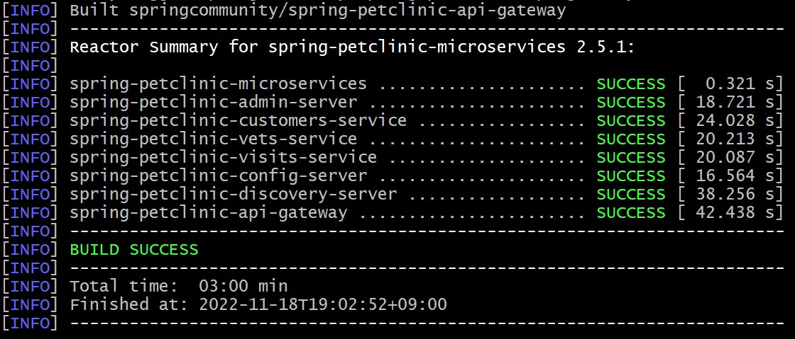
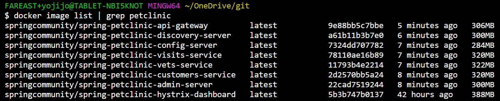
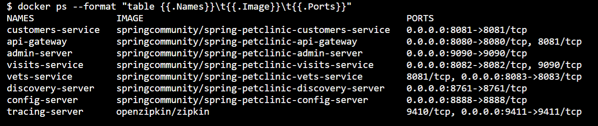
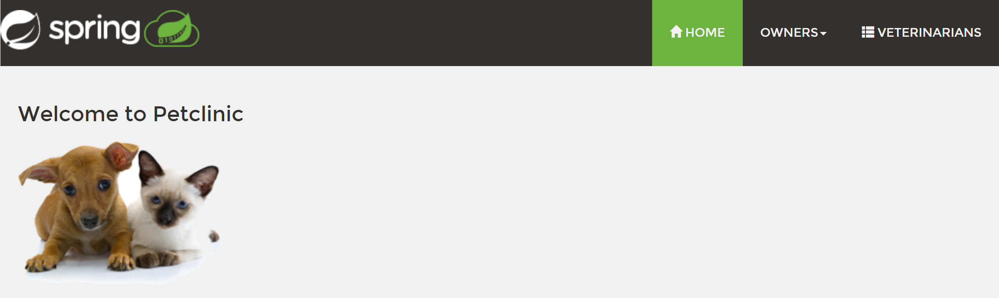
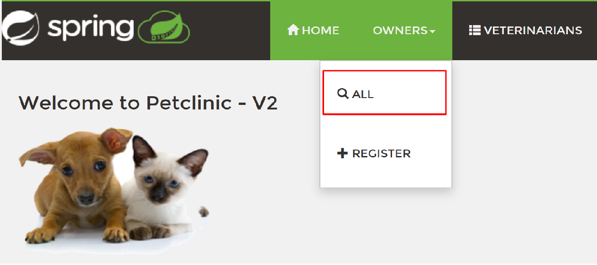
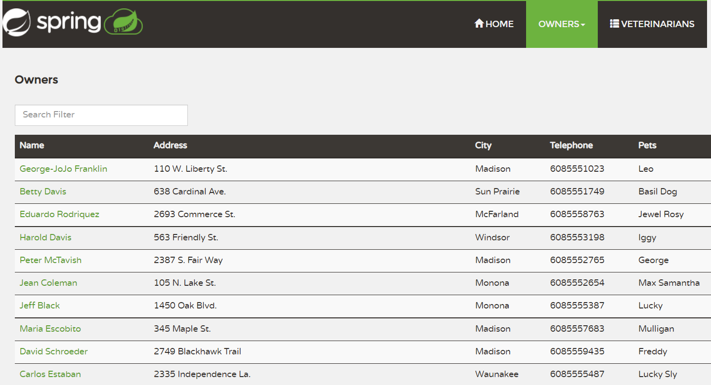
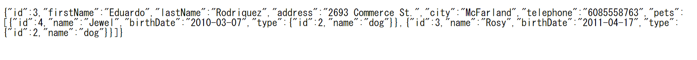

# 演習1) タスク１ - ローカル環境でのプロジェクトの実行

演習 1 では事前準備でローカル環境にクローンした プロジェクトをローカル環境で実行して、動作を確認します。

この演習を行うことで、ローカル環境の実行より、クラウドへデプロイ前に動作確認方法を学ぶことができます。

この演習で実施するタスクは以下のとおりです。

<br>

## ローカル環境でのプロジェクトの実行

事前準備でローカル環境にクローンしたプロジェクト **springapps-petclinic-microservices** が Spring Boot アプリケーションとして正しく起動し、Github の Config リポジトリと連携して正しく動作するかを確認します。<br>
ローカル実行は複数の方法があります。
* java コマンドで jar ファイルを直接実行。例：<br>
 `java -jar spring-petclinic-customers-service/target/*.jar --server.port=8081 --spring.profiles.active=chaos-monkey`
* maven プラグインで実行。例：<br>
 `mvn spring-boot:run -Dspring.profiles.active=development`
* Docker コンテナとして実行。例：<br>
 `docker run -p 3306:3306 springcommunity/spring-petclinic-customers-service:latest`

Azure Spring Apps は Kubenetes を基盤にして構築されていますので、今回は Docker コンテナの形式でローカル実行します。　


### 作業
1. Docker Desktop を起動します。

2. 演習の [準備]でローカルに clone した springapps-petclinic-microservices のディレクトリをターミナル画面で開きます。

3. 以下のコマンドを実行します。

    ```
    mvn clean install -DskipTests -P buildDocker
    ```

	 以下の内容が表示されたら、実行完了です。なお、コマンドの完了まで数分かかります。　<br><br>

	


4. 以下のコマンドで作成したコンテナイメージを表示します。

	* \[Bash\]

		```
		docker image list | grep petclinic
		```

	* \[PowerShell\]

		```
		docker image list "springcommunity/spring-petclinic*"
		```


	コンテナイメージリストは下記の通りです。　<br>
	
	

5. 以下のコマンドでコンテナを起動します。

	```
	docker-compose -f docker-compose.yml up
	```

6. もう 1 つターミナル画面で開きます、実行しているコンテナのプロセスを確認します。

	```
	docker ps --format "table {{.Names}}\t{{.Image}}\t{{.Ports}}"
	```

	合計 8 個のコンテナが立ち上がりました<br><br>
	

## 確認
7. docker-compose コマンドを実行したターミナル画面で、ポート 8080 でのホストが開始されたのを確認後、 UI を確認するため、Web ブラウザーから以下の URL にアクセスします。

	http://localhost:8080/

	以下の画面が表示されたことを確認します。<br><br>
	<br><br>

	さらに上部の `OWNERS` メニューをクリックし、`ALL` メニューを選択します。

	 <br>

	オーナーの詳細情報が表示されたことを確認します。<br>

	
	
2. API を確認するため、Web ブラウザーから以下の URL にアクセスします。

	http://localhost:8080/api/customer/owners/3

	JSON のレスポンスが返ってきたことを確認します。

	<br>

	各ターミナル画面でキーボートの `[Ctrl] + [C]` を押して、サービスを終了します。

## 参照情報
- <a href="https://learn.microsoft.com/ja-jp/azure/spring-apps/overview" target="_blank">Azure Spring Apps の概要</a>
- <a href="https://learn.microsoft.com/ja-jp/azure/spring-apps/how-to-prepare-app-deployment" target="_blank">Azure Spring Apps にデプロイするアプリケーションを準備する</a>

<br>

次の手順へ : [**タスク 2 - Azure リソースの作成**](P1-02.md)

前の手順へ : [**事前準備**](Common.md)

READMEへ :  [**README**](../README.md)
