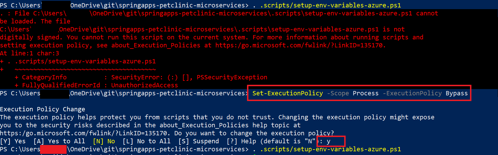
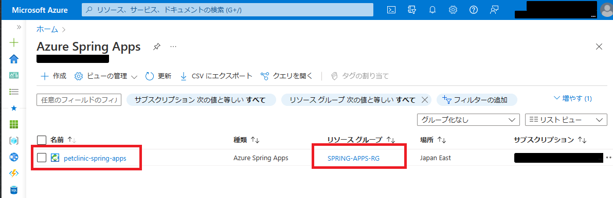
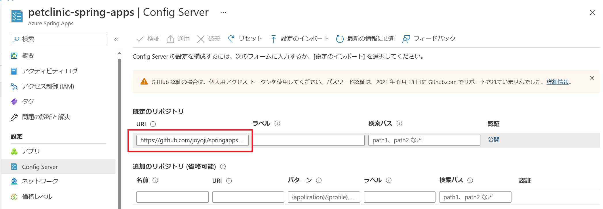

# 演習1) タスク 2 - Azure リソースの作成
Azure へデプロイ前に必要な準備作業を行います。

## 環境設定
1. ターミナル画面を開き、cd コマンドを使用して作業ディレクトリをプロジェクト **springapps-petclinic-microservices** のディレクトリにします。

2. 以下のコマンドを実行して Azure にログインします。

    ```
    # 既定のブラウザーが開いて Azure サインイン ページが表示されるので、アカウントの資格情報を使用してサインインします。
    az login
    ```

3. 以下のコマンドを実行するとサブスクリプションの一覧が返るので、今回の演習に使用する SubscriptionId をメモしておきます。

    ```
    az account list -o table
    ```

    デフォルトで使用する サブスクリプション を設定います。

    ```
    az account set --subscription メモしておいた SubscriptionId
    ```

4. 前の手順でメモしておいた SubscriptionId と Azure Spring Apps のサービス名を環境変数にセットします。

    Azure Spring Apps のサービス名もメモしておきます。

    > **<span style="color: red; ">重要</span>**  
    > <span style="color: red; "> - Azure Spring Apps のサービス名は Azure プラットフォーム全体で一意である必要があります、ご注意ください。 </span> 

    \[Bash\]
    ```
    SubscriptionId=メモしておいた SubscriptionId
    ServiceName=ユニークな 32 文字以内の名前、例、petclinic-spring-apps-1951235 (そのまま使用しないでください)
    ```

    \[PowerShell\]
    ```
    $env:SubscriptionId="メモしておいた SubscriptionId"
    $env:ServiceName="ユニークな 32 文字以内の名前、例、petclinic-spring-apps-1951235" (そのまま使用しないでください)
    ```

5.  以下のコマンドで、環境変数を設定するシェル スクリプトファイル(Bash : setup-env-variables-azure.sh/PowerShell : setup-env-variables-azure.ps1)の内容を書き換えます。

    \[Bash\]

    ```
    sed -i "s/SubscriptionId/${SubscriptionId}/g" .scripts/setup-env-variables-azure.sh
    sed -i "s/petclinic-spring-apps/${ServiceName}/g" .scripts/setup-env-variables-azure.sh    
    ```

    \[PowerShell\]

    ```
    $data=Get-Content .scripts/setup-env-variables-azure.ps1 | % {$_ -replace "SubscriptionId",$env:SubscriptionId}
    $data | Out-File .scripts/setup-env-variables-azure.ps1 -Encoding UTF8
    $data=Get-Content .scripts/setup-env-variables-azure.ps1 | % {$_ -replace "petclinic-spring-apps",$env:ServiceName}
    $data | Out-File .scripts/setup-env-variables-azure.ps1 -Encoding UTF8    
    ```

    なおこの作業は手動でファイルを書き換えてもかまいません。

    更新済みのファイルの内容を確認するには以下のコマンドを実行します。

    \[Bash\]
    ```
    cat .scripts/setup-env-variables-azure.sh | grep -e SUBSCRIPTION -e SPRING_APPS_SERVICE
    ```

    \[PowerShell\]
    ```
    Select-String -path .scripts/setup-env-variables-azure.ps1 "SUBSCRIPTION"
    Select-String -path .scripts/setup-env-variables-azure.ps1 "SPRING_APPS_SERVICE"    
    ```

6. シェル スクリプト ファイルを実行し、環境変数を設定します。

    \[Bash\]
    ```
    source .scripts/setup-env-variables-azure.sh
    ```

    \[PowerShell\]
    ```
    . .scripts/setup-env-variables-azure.ps1
    ```
    もし `...setup-env-variables-azure.ps1 is not digitally signed. You cannot run this script on the current system...` のようなエラーが発生すると、以下のコマンドを実行します。

    \[PowerShell\]
    ```
    Set-ExecutionPolicy -Scope Process -ExecutionPolicy Bypass
    # Y を入力して [Enter] を押します。
    . .scripts/setup-env-variables-azure.ps1
    ```

	<br><br>    

7. Spring Apps の CLI 拡張機能をインストールします。
    
    ```
    az extension add --name spring
    ```

8. 以降のコマンドを簡潔にするため、CLI のデフォルトパラメーターを設定します。

    \[Bash\]
    ```
    az configure --defaults \
        group=${RESOURCE_GROUP} \
        location=${REGION} \
        spring=${SPRING_APPS_SERVICE} 
    ```

    \[PowerShell\]
    ```
    az configure --defaults group=$env:RESOURCE_GROUP location=$env:REGION spring=$env:SPRING_APPS_SERVICE
    ```

    設定したデフォルト値を確認します。

    ```
    az config get
    ```

## リソースグループと Spring Apps プランを作成

1. リソースグループを作成します。

    \[Bash\]
    ```
    az group create --name ${RESOURCE_GROUP} --location ${REGION}

    # 作成済みのリソースグループを確認
    az group list --query "[?name=='${RESOURCE_GROUP}']"
    ```

    \[PowerShell\]
    ```
    az group create --name $env:RESOURCE_GROUP --location $env:REGION

    # 作成済みのリソースグループを確認
    az group list --query "[?name=='$env:RESOURCE_GROUP']"
    ```

2. Spring Apps のプランを作成します。

    作成には 5 分ほどかかるため、少々お待ちください。

    \[Bash\]
    ```
    az spring create --name ${SPRING_APPS_SERVICE} \
            --sku standard \
            --sampling-rate 100 \
            --resource-group ${RESOURCE_GROUP} \
            --location ${REGION}
    ```

    \[PowerShell\]
    ```
    az spring create --name $env:SPRING_APPS_SERVICE --sku standard --sampling-rate 100 --resource-group $env:RESOURCE_GROUP --location $env:REGION
    ```

## Spring Cloud Config Server を設定
Config Server は、分散システムのための一元化された構成サービスです。

現時点でローカル ストレージ、Git、および Subversion をサポートしており、プラガブルなリポジトリ レイヤーを使用します。 

1. ターミナル画面に、アプリ直下の application.yml の設定を確認します。

    \[Bash\]
    ```
    grep "uri" application.yml
    ```

    \[PowerShell\]
    ```
    Select-String -path application.yml "uri"
    ```
    このコマンドで期待される返り値は以下です。

    ```
    uri: https://github.com/{各自の github アカウント}/springapps-petclinic-microservices-config
    ```


2. 設定を Azure へ登録するため、以下のコマンドを実行します。

    \[Bash\]
    ```
    az spring config-server set \
        --config-file application.yml \
        --name ${SPRING_APPS_SERVICE}
    ```

    \[PowerShell\]
    ```
    az spring config-server set --config-file application.yml --name $env:SPRING_APPS_SERVICE
    ```

## 確認
1. [**Azure Portal**](https://portal.azure.com/#view/HubsExtension/BrowseResource/resourceType/Microsoft.AppPlatform%2FSpring) へアクセス、リソースが正常に作成されたことを確認します。

	<br><br>

2. 対象の `Spring Apps` をクリックして、次の画面に `Config Server` メニューを押下します。

   各自のリポジトリが設定されたことを確認します。

	<br><br>
   

## 参照情報
- <a href="https://learn.microsoft.com/ja-jp/azure/spring-apps/overview" target="_blank">Azure Spring Apps の概要</a>
- <a href="https://learn.microsoft.com/ja-jp/azure/spring-apps/quickstart?tabs=Azure-CLI" target="_blank">初めてのアプリケーションを Azure Spring Apps にデプロイする</a>

---
次の手順へ : [**タスク 3 - Visual Studio Code を使用した Azure Spring Apps のデプロイ**](P1-03.md)

前の手順へ : [**タスク 1 - ローカル環境でのプロジェクトの実行**](P1-01.md)

READMEへ :  [**README**](../README.md)
