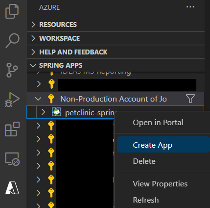

# 演習1) タスク 3 - Visual Studio Code を使用した Azure Spring Apps のデプロイ
アプリケーションのデプロイ方法には、Visual Studio Code の Azure Spring Apps 拡張機能 または Azure CLI、Github Actions、PowerShell 等の方法があります。

今回のハンズオンに 5 つのアプリのデプロイ方法は下記の通りです。
このタスクでは、 cosutomers-service アプリのデプロイを行い、残りのアプリは次のタスクにて Azure CLI を使用してデプロイします。

|  アプリ名  |  デプロイ方法  |
| ---- | ---- |     
| customers-service|  Visual Studio Code |
| admin-server |  Azure CLI |
| vets-service |  Azure CLI |
| visits-service |  Azure CLI |
| api-gateway |  Azure CLI |

<br>

## 事前準備
1. 前のステップに開いたターミナル画面を引き続き使用します。

    ```bash
    # springapps-petclinic-microservices の直下であることを確認
    pwd
    ```
<br>

2. ソースコードをコンパイルします。
    ```bash
    mvn clean package -DskipTests -Denv=cloud
    ```

3. Visual Studio Code を起動します。Visual Studio Code の横メニューの `Azure アイコン`をクリックします。次は、SPRING APPS 下の `Sign in to Azure...` をクリックします。

	<br><br>

4. 既定のブラウザーが開いて Azure サインイン ページが表示されます。アカウントの資格情報を使用してサインインします。

    成功の場合、ブラウザに以下の画面が表示されます。

	<br><br>

## App の作成 
1. Spring APPS 欄に、演習で使用している`サブスクリプション名`をクリックして展開します。前の手順に Azure CLI で作成した Spring APPS プランが表示されます。

    右クリックして `Create App` をクリックします。 

	<br><br>

2. App の名称を設定するために `customers-service` を 入力します。`Enter` を押下します。

	<br><br>

3. Java のランタイムを設定するため `Java11` を選択します。`Enter` を押下します。

	<br><br> 

4. Visual Studio Code の右下に進捗欄が表示されます。

	<br><br>       

5. 右下進捗欄に `Successfully created Spring app "customers-service".` が表示されたら、アプリ作成は完了です。

   petclinic-spring-apps を展開して、作成した customers-service を確認できます。

	<br><br>

   表示されない場合、 `petclinic-spring-apps` を選択して、右クリックします。メニューから `Refresh` を押下します。
   
	<br><br>         

## App のデプロイ
1. customers-service を右クリックし、表示されたコンテキストメニューから `Deploy` を選択します。

    <br><br> 

2. ローカルマシンのプロジェクトフォルダにある下記の jar ファイルを選択して、`選択`ボタンを押下します。

    `springapps-petclinic-microservices/spring-petclinic-customers-service/target/spring-petclinic-customers-service-2.5.1.jar`

    <br><br> 

   右下進捗欄に以下のステータスが表示されます。

    <br><br> 

3. Visual Studio Code の右下に以下のステータスが表示されたら、デプロイ完了です。

   サービスをインターネットに公開する必要があれば、 `Access public endpoint` をクリックします。
   
   今回は必要ないので、そのままメッセージウィンドウを閉じます。

    <br><br> 

## 参照情報
- <a href="https://learn.microsoft.com/ja-jp/azure/spring-apps/overview" target="_blank">Azure Spring Apps の概要</a>
- <a href="https://code.visualstudio.com/docs/java/java-spring-apps" target="_blank">VS Code を使用してアプリをデプロイする</a>

---
次の手順へ : [**タスク 4 - Azure CLI を使用した Azure Spring Apps のデプロイ**](P1-04.md)

前の手順へ : [**タスク 2 - Azure リソースの作成**](P1-02.md)

READMEへ :  [**README**](../README.md)
