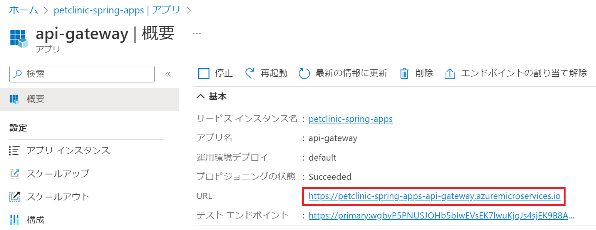

# 演習1) タスク 4 - Azure CLI を使用した Azure Spring Apps のデプロイ
Azure CLI を使用して Azure Spring Apps をデプロイします。

なお、この手順は作業を行うターミナルにコマンドで使用する環境変数が設定されている必要があります。

演習1) タスク 2 で使用したターミナルを引き続き使用する場合はそのままでかまいませんが、新しいターミナル画面を使用する場合は、ローカルのプロジェクト springapps-petclinic-microservices のルートディレクトリを作業ディレクトリとし、以下のコマンドを実行してください。

 \[Bash\]
```
source .scripts/setup-env-variables-azure.sh
```

\[PowerShell\]
```
. .scripts/setup-env-variables-azure.ps1
 ```


## 作業
1. 下記の順番でアプリを新規作成します。

    ターミナル画面で以下のコマンドをそれぞれ実行します。

    \[Bash\]
    ```
    az spring app create --name ${ADMIN_SERVER} --instance-count 1 --assign-endpoint true \
        --runtime-version Java_11 --memory 1Gi --cpu 500m \
        --jvm-options='-Xms1024m -Xmx1024m'
        
    az spring app create --name ${VETS_SERVICE} --instance-count 1 \
        --runtime-version Java_11 --memory 1Gi --cpu 500m \
        --jvm-options='-Xms1024m -Xmx1024m'
    
    az spring app create --name ${VISITS_SERVICE} --instance-count 1 \
        --runtime-version Java_11 --memory 1Gi --cpu 500m \
        --jvm-options='-Xms1024m -Xmx1024m'

    az spring app create --name ${API_GATEWAY} --instance-count 1 --assign-endpoint true \
        --runtime-version Java_11 --memory 1Gi --cpu 500m \
        --jvm-options='-Xms1024m -Xmx1024m -Dspring.profiles.active=azure'
    ```

    \[PowerShell\]
    ```
    az spring app create --name $env:ADMIN_SERVER --instance-count 1 --assign-endpoint true --runtime-version Java_11 --memory 1Gi --cpu 500m --jvm-options='-Xms1024m -Xmx1024m'
        
    az spring app create --name $env:VETS_SERVICE --instance-count 1 --runtime-version Java_11 --memory 1Gi --cpu 500m --jvm-options='-Xms1024m -Xmx1024m'
    
    az spring app create --name $env:VISITS_SERVICE --instance-count 1 --runtime-version Java_11 --memory 1Gi --cpu 500m --jvm-options='-Xms1024m -Xmx1024m'

    az spring app create --name $env:API_GATEWAY --instance-count 1 --assign-endpoint true --runtime-version Java_11 --memory 1Gi --cpu 500m --jvm-options='-Xms1024m -Xmx1024m -Dspring.profiles.active=azure'
    ```

2. 下記の順番で jar ファイルをデプロイします。

    \[Bash\]
    ```
    az spring app deploy -n ${ADMIN_SERVER} \
        --artifact-path ${ADMIN_SERVER_JAR}


    az spring app deploy -n ${VETS_SERVICE} \
        --artifact-path ${VETS_SERVICE_JAR} 
            
    
    az spring app deploy -n ${VISITS_SERVICE} \
        --artifact-path ${VISITS_SERVICE_JAR} 

    az spring app deploy -n ${API_GATEWAY} \
        --artifact-path ${API_GATEWAY_JAR} \
    ```

     \[PowerShell\]
    ```
    az spring app deploy -n $env:ADMIN_SERVER --artifact-path $env:ADMIN_SERVER_JAR

    az spring app deploy -n $env:VETS_SERVICE --artifact-path $env:VETS_SERVICE_JAR
    
    az spring app deploy -n $env:VISITS_SERVICE --artifact-path $env:VISITS_SERVICE_JAR

    az spring app deploy -n $env:API_GATEWAY --artifact-path $env:API_GATEWAY_JAR
    ```

## デプロイの確認
1. 下記のリンクより Azure Portal へアクセスします。

    https://portal.azure.com/#view/HubsExtension/BrowseResource/resourceType/Microsoft.AppPlatform%2FSpring

2. 作成済み Spring Apps リソースの一覧が表示されるので、このハンズオン用の `petclinic-spring-apps` をクリックします。

   遷移先の画面で、画面左のメニューブレードの \[**アプリ**\]メニューをクリックします。アプリの一覧が表示されるのでプロビジョニングが全て`成功`であることを確認します。
    <br>
    

## 動作確認
1. 前の手順で表示した `petclinic-spring-apps` のアプリ一覧で`api-gateway` をクリックします。
　
    `api-gateway` の**概要** 画面が表示されるので、\[**URL**\] をメモしておきます。この URL はアクセス用のエンドポイントとなります。

    

   同様に、`petclinic-spring-apps` のアプリ一覧から `admin-server`　をクリックし、概要 画面の \[**URL**\] をメモしておきます。  

    

2. 前の手順でメモした `api-gateway` の URL にアクセスします。

    トップページが表示されます。<br>
    

    画面上部のメニューバーから `OWNERS` をクリックし、`ALL` メニューを選択します。<br>
 
     <br>

    オーナーの詳細情報が表示されたことを確認します。<br>
        

3. API を確認するために、Web ブラウザーから以下の `URL` にアクセスします。

    http://{上記 api-gateway の URL}/api/customer/owners/3

    API のレスポンス表示はブラウザーや設定次第で変わります。下記 Microsoft Edge の表示例となります。

     

    右クリックして、`View page source` を選択します。タグ付きの XML レスポンスが表示されます。

    

    以上で、`api-gateway` が正常に動作していることが確認できます。     

4. 前の手順でメモしておいた `admin-server の URL` へアクセスします。

    

    <br>

    画面上部のメニューバーより `Wallboard` をクリックし、情報が正しく表示されることを確認します。

    

## 参照情報
- <a href="https://learn.microsoft.com/ja-jp/azure/spring-apps/overview" target="_blank">Azure Spring Apps の概要</a>
- <a href="https://learn.microsoft.com/ja-jp/azure/spring-apps/how-to-launch-from-source" target="_blank">Azure CLI から Spring Boot アプリケーションをデプロイする方法</a>
- <a href="https://learn.microsoft.com/ja-jp/azure/spring-apps/how-to-maven-deploy-apps" target="_blank">Maven を使用して Spring Boot アプリケーションをデプロイする</a>

---
次の手順へ : [**演習 2) タスク 1 - GitHub Actions 雛形を作成**](P2-01.md)

前の手順へ : [**タスク 2 - Visual Studio Code を使用した Azure Spring Apps のデプロイ**](P1-03.md)

READMEへ :  [**README**](../README.md)    
