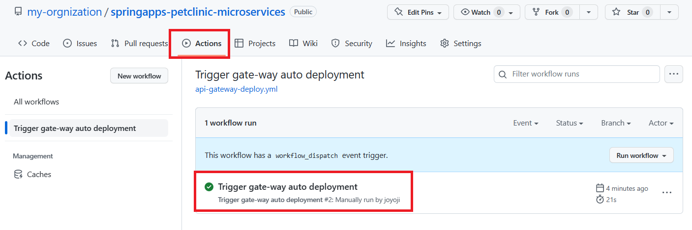

# 演習 2) タスク 1 - GitHub Actions 雛形を作成
対象リポジトリにて新規ファイルを作成し、GitHub Actions の雛形を作成して、後続の演習で CI/CD 用の処理を追加していきます。

GitHub Actions のワークフローはレポジトリのコードをダウンロードして、レポジトリ名を変数に設定して、最後変数の値を出力します。

> **注:** 演習作業簡略化のため、ファイルの作成と編集は master ブランチに対して直接行います。

## 作業
1. GitHub リポジトリにて新規ファイルを作成します。  

    

2. 下記コードをコピーして、 `.github/workflows/api-gateway-deploy.yml` として作成します。
    ```yaml
    name: Trigger gate-way auto deployment
    on:
      # 手動実行用トリガー
      workflow_dispatch:

    jobs:
      build:
        runs-on: ubuntu-latest
        steps:
        - name: Checkout your repo
          uses: actions/checkout@v2

        - name: Set repository name to env
          run: | 
            echo "REPOSITORY_NAME=${GITHUB_REPOSITORY#${GITHUB_REPOSITORY_OWNER}/}" >> $GITHUB_ENV
        - name: Confirm if env have REPOSITORY_NAME
          run: |
            echo ${{ env.REPOSITORY_NAME }}
    ```
    > **注:**  
    > - インデントに注意してください。  
    > - 変更内容は直接 `master` ブランチにコミットしてください。

    <br>
    ファイル編集画面は以下の通りに表示されます。

    

<br>

## 確認
1. api-gateway-deploy.yml ファイルが正常に作成できたことを確認します。

    
  
2. `Actions`タブにて、対象ワークフロー`Trigger gate-way auto deployment`を選択し、`Run workflow`メニューから`Run workflow`ボタンをクリックし、手動実行でワークフローを起動します。 
  
    
  
3. `Actions`タブにて、実行済みのワークフローを選択します。
  
    

    `build` ジョブをクリックします。

    

    各ステップの結果一覧に、`Confirm if env have REPOSITORY_NAME` をクリックします。

    ワークフロー処理はエラーなく終了し、build ジョブのログにリポジトリ名が出力されていることを確認します。

    

## 参照情報

- <a href="https://learn.microsoft.com/ja-jp/azure/spring-apps/how-to-github-actions?pivots=programming-language-java" target="_blank">GitHub Actions で Azure Spring Apps の CI/CD を使用する</a>
- <a href="https://docs.microsoft.com/devops/what-is-devops" target="_blank">What is DevOps?</a>

- **GitHub**

    - <a href="https://docs.github.com/en/actions/quickstart" target="_blank">Quickstart for GitHub Actions</a>
    - <a href="https://docs.github.com/en/repositories/working-with-files/managing-files/creating-new-files" target="_blank">Creating new files</a>
    - <a href="https://docs.github.com/en/actions/monitoring-and-troubleshooting-workflows/using-workflow-run-logs#viewing-logs-to-diagnose-failures" target="_blank">Viewing logs to diagnose failures</a>

---
次の手順へ: [**タスク 2 - アプリのコンパイルジョブ追加**](P2-02.md)

前の手順へ: [**講習 1) タスク 4 - Azure CLI を使用したアプリケーションのデプロイ**](P1-04.md)

READMEへ: [**README**](../README.md#%E6%93%8D%E4%BD%9C%E6%89%8B%E9%A0%86) 
