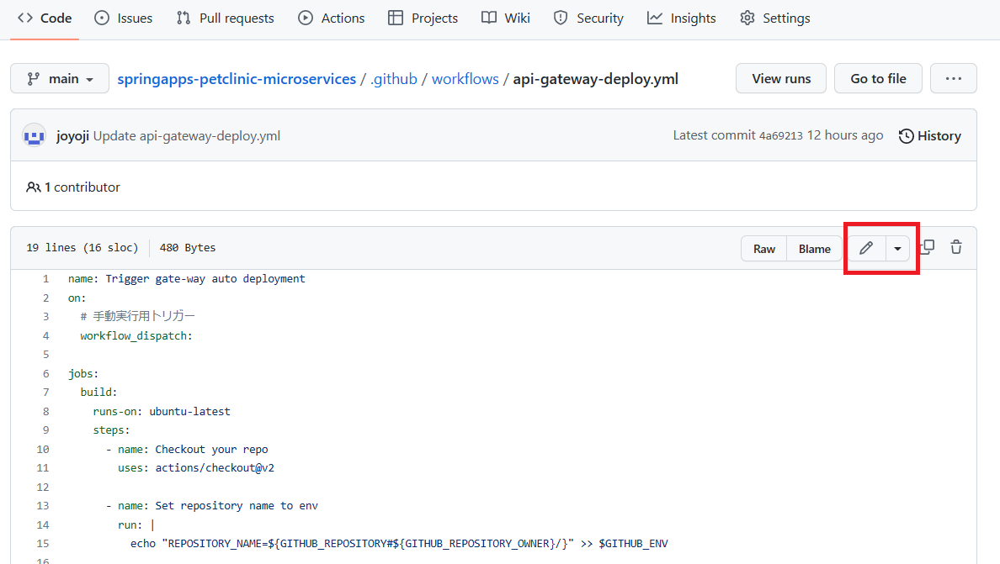
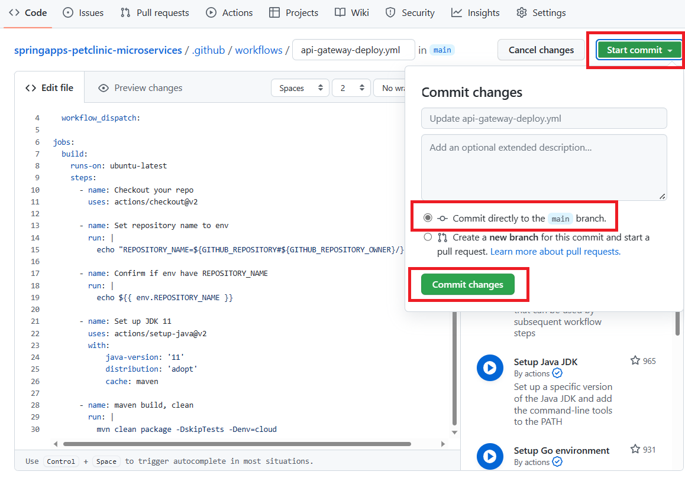
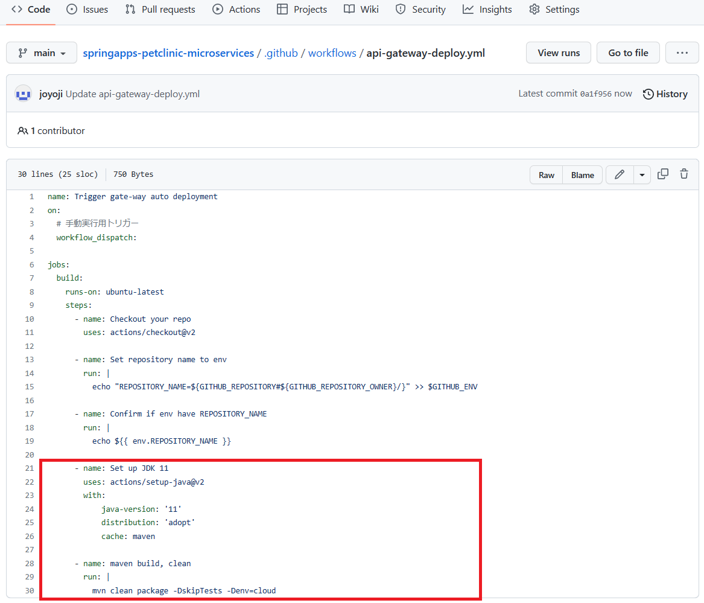
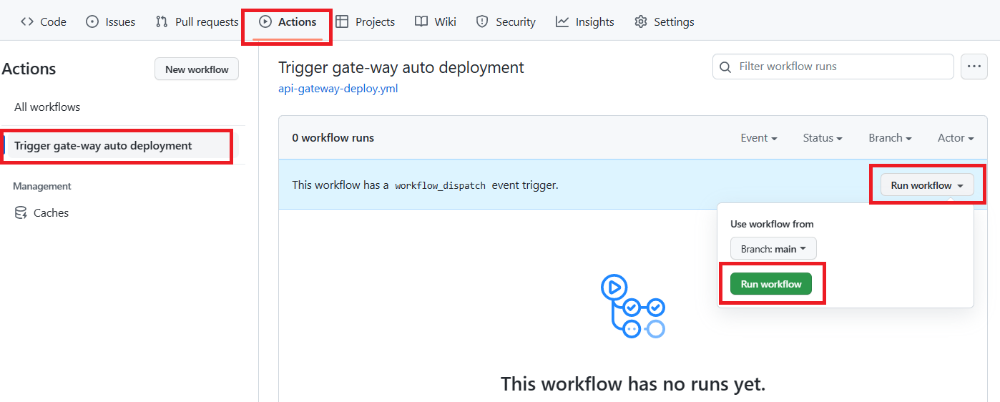
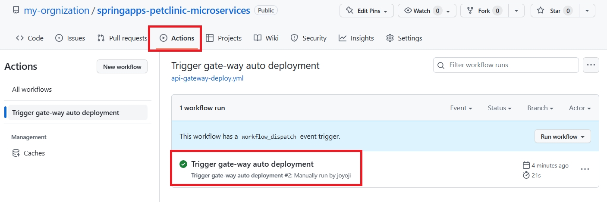
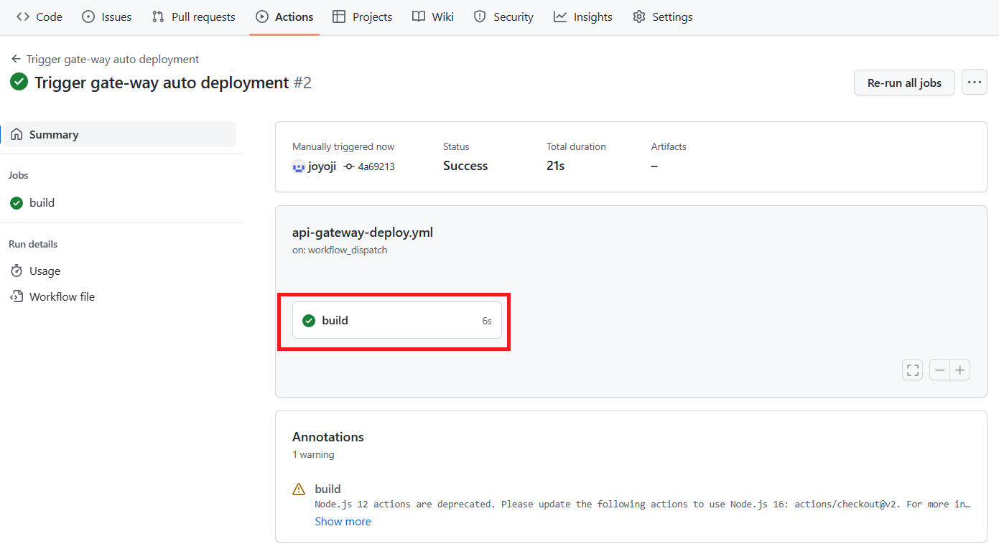
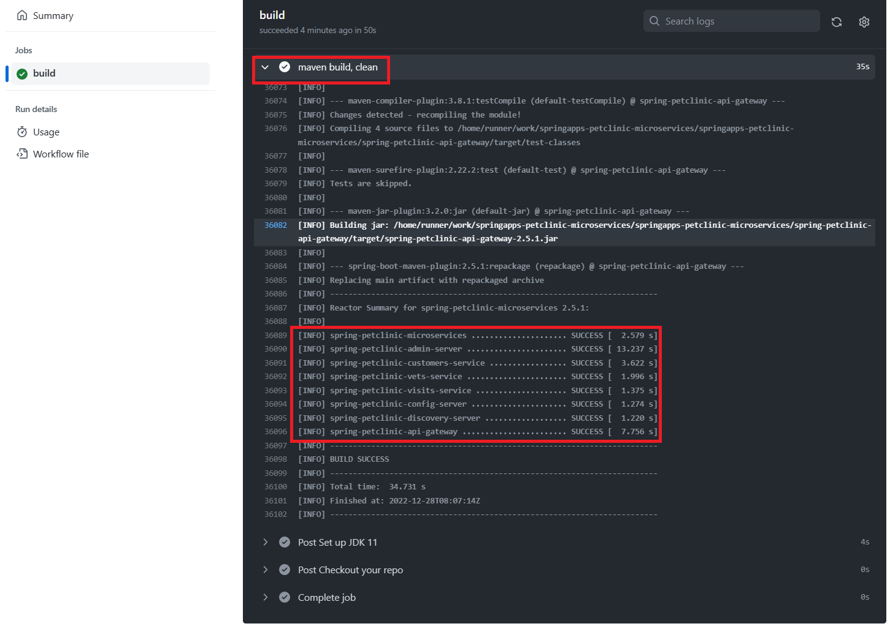

# 演習 2) タスク 2 - アプリのコンパイルジョブ追加

GitHub Actions のワークフローは JDK セットアップを行い、次はアプリのコンパイル処理を実施ます。

> **注:** 演習作業簡略化のため、ファイルの作成と編集は master ブランチに対して直接行います。

## 作業
1. 鉛筆マークのボタンをクリックし、`.github/workflows/api-gateway-deploy.yml` ファイルを編集モードで開きます。

    

2. 下記 `step` のコードを `.github/workflows/api-gateway-deploy.yml` ファイルの末尾に追加します。  

    ```yaml
        - name: Set up JDK 11
          uses: actions/setup-java@v2
          with:
            java-version: '11'
            distribution: 'adopt'
            cache: maven

        - name: Maven build, clean
          run: |
            mvn clean package -DskipTests -Denv=cloud
    ```
    > **注:**  
    > - インデントに注意してください。  
    > - 変更内容は直接 `master` ブランチにコミットしてください。　

    <br>

    

## 確認

1. 以下赤枠でマークされている修正内が `.github/workflows/api-gateway-deploy.yml` ファイルに反映されていることを確認します。
  
    
  
2. [**演習 2) タスク 1 - GitHub Actions 雛形を作成 > 確認 > 2.**](P2-01.md#確認) と同様に、手動実行でワークフローを起動します。
  
    

3. `Actions`タブにて、実行済みのワークフローを選択します。

    

    `build` ジョブをクリックします。

    

    各ステップの結果一覧に、`Maven build, clean` をクリックします。

    ワークフロー処理がエラーなく終了し、全てのアプリのコンパイル ステータスが `SUCCESS` になったことを確認してください。

    

## 参照情報
- <a href="https://learn.microsoft.com/ja-jp/azure/spring-apps/how-to-github-actions?pivots=programming-language-java" target="_blank">GitHub Actions で Azure Spring Apps の CI/CD を使用する</a>
- **GitHub**

    - <a href="https://docs.github.com/en/actions/monitoring-and-troubleshooting-workflows/about-monitoring-and-troubleshooting" target="_blank">About monitoring and troubleshooting</a>
---
次の手順へ: [**タスク 3 - Azure 接続処理を追加**](P2-03.md)

前の手順へ: [**タスク 1 - GitHub Actions 雛形作成**](P2-01.md)

READMEへ: [**README**](../README.md#%E6%93%8D%E4%BD%9C%E6%89%8B%E9%A0%86)
