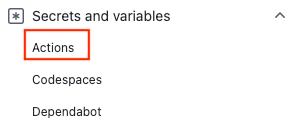

# 演習 2) タスク 3 - Azure 接続処理を追加
GitHub Actions を使って Azure リソースをデプロイするため、Azure 側と GitHub 側の認証関連の設定を行います。そして、 GitHub Actions に Azure への Login 処理を追加します。

> **注:** 演習作業簡略化のため、ファイルの作成と編集は master ブランチに対して直接行います。

この手順は作業を行うターミナルにコマンドで使用する環境変数が設定されている必要があります。

演習1) タスク 2 で使用したターミナルを引き続き使用する場合はそのままでかまいませんが、新しいターミナル画面を使用する場合は、

ローカルのプロジェクト springapps-petclinic-microservices のルートディレクトリを作業ディレクトリとし、以下のコマンドを実行してください。

 \[Bash\]
```
source .scripts/setup-env-variables-azure.sh
```

\[PowerShell\]
```
. .scripts/setup-env-variables-azure.ps1
 ```

## 作業
### サービス プリンシパルを作成
1. Azure AD アプリの作成、 IAM 設定、Secrets の設定を行います。

    下記のコマンドにプリンシパル名を設定してコマンドを実行します。

    -n petclinic-spring-apps-XXXX: XXXX を任意の数字と文字で入れ替え、一意の名称を入力してください。
    
    \[Bash\]

    ```bash
    # Git Bash for Windows を使用する場合、 Git Bash でパス変換が予期せぬ動作を避けるための対処法となります。
    # Git Bash for Windows 以外使用する場合、無視してください。
    export MSYS_NO_PATHCONV=1

    az ad sp create-for-rbac -n petclinic-spring-apps-XXXX --role contributor --scopes /subscriptions/${SUBSCRIPTION} --sdk-auth
    ```

    \[PowerShell\]

    ```
    az ad sp create-for-rbac -n petclinic-spring-apps-XXXX --role contributor --scopes /subscriptions/$env:SUBSCRIPTION --sdk-auth
    ```
    > **注:**  
    > - プリンシパル名重複のエラーが出ると、petclinic-spring-apps-XXXX を修正して再度実行してください。

2. 新しく作成されたサービス プリンシパルは以下の形式で出力されますので、メモに残しておきます。なお、`clientSecret` はこのタイミングでしか確認できませんので、ご注意ください。
    ```bash
    {
        "clientId": "<GUID>",
        "clientSecret": "<GUID>",
        "subscriptionId": "<GUID>",
        "tenantId": "<GUID>",
        "activeDirectoryEndpointUrl": "https://login.microsoftonline.com",
        "resourceManagerEndpointUrl": "https://management.azure.com/",
        "sqlManagementEndpointUrl": "https://management.core.windows.net:8443/",
        "galleryEndpointUrl": "https://gallery.azure.com/",
        "managementEndpointUrl": "https://management.core.windows.net/"
    }
    ```

### GitHub シークレットの作成
1. GitHub シークレットを作成するため、GitHub リポジトリを開き、 `[Settings]` （設定） に移動します。

    

2.  `[Security]`（セキュリティ） > `[Secrets and variables]`（シークレットと変数） > `[Actions]`（アクション） の順に選択します。

    

3. `[New repository secret]` ボタンをクリックして、シークレットを新規作成します。    

    

4. 以下の通り入力したら、`[Add secret]` ボタンを押下します。

    GitHub シークレット名: `AZURE_CREDENTIALS` 

    シークレット値: 上記で出力されたサービス プリンシパル

    

## 参照情報

- <a href="https://docs.microsoft.com/ja-jp/azure/active-directory/develop/quickstart-register-app" target="_blank">Microsoft ID プラットフォームにアプリケーションを登録する</a>
- <a href="https://learn.microsoft.com/ja-jp/cli/azure/ad/sp?view=azure-cli-latest#az-ad-sp-create-for-rbac" target="_blank">Azure Active Directory サービス プリンシパルを管理(az ad sp)</a>

- **GitHub**

    - <a href="https://docs.github.com/en/actions/deployment/security-hardening-your-deployments/configuring-openid-connect-in-azure" target="_blank">Configuring OpenID Connect in Azure</a>
    - <a href="https://docs.github.com/ja/actions/deployment/security-hardening-your-deployments/configuring-openid-connect-in-amazon-web-services#adding-permissions-settings" target="_blank">Adding permissions settings</a>
---
次の手順へ: [**タスク 4 - アプリをデプロイする処理を追加**](P2-04.md)

前の手順へ: [**タスク 2 - アプリのコンパイルジョブ追加**](P2-02.md)

READMEへ: [**README**](../README.md#%E6%93%8D%E4%BD%9C%E6%89%8B%E9%A0%86)
