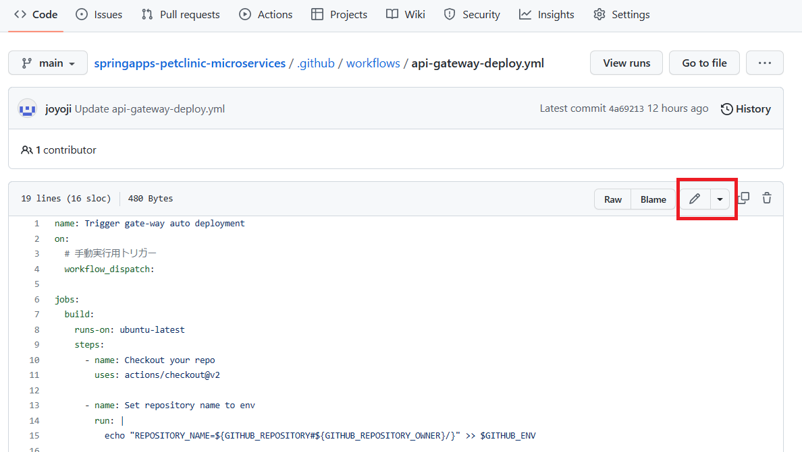
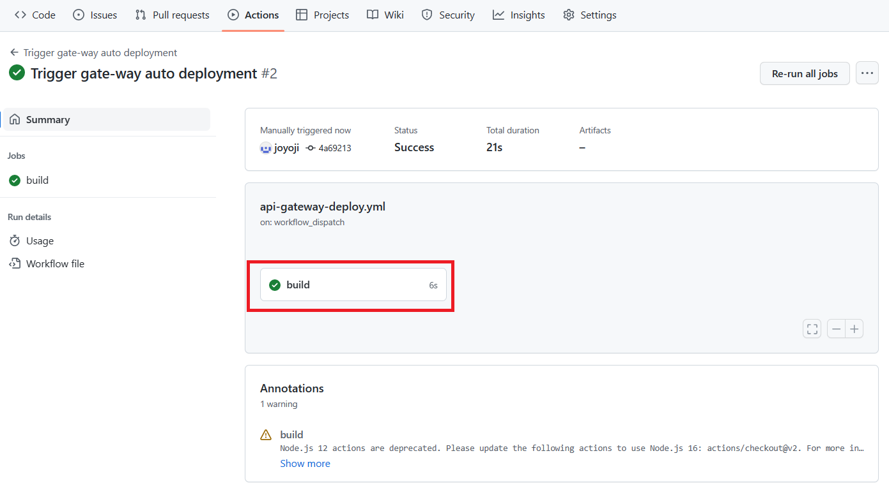
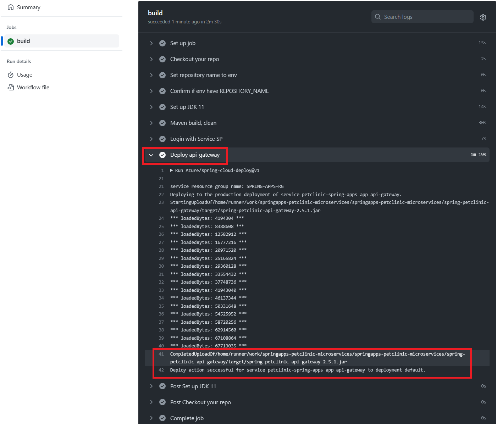

# 演習 2) タスク 4 - Deploy ジョブを追加
GitHub Actions のワークフローは Azure にログインして、前の手順にコンパイルしたアプリ jar ファイルを Azure Spring Apps へデプロイします。

> **注:** 演習作業簡略化のため、ファイルの作成と編集は master ブランチに対して直接行います。

## 作業
1. タスク 2 の 1. と同様の手順で、`.github/workflows/api-gateway-deploy.yml` ファイルを編集モードで開きます。

    
<br>

2. 環境変数を設定するため、以下のコードをトリガーと jobs の間に追加します。

    各項目を以下のように設定します。

    AZURE_SUBSCRIPTION: [**講習 1) タスク 2 - Azure リソースの作成**](P1-02.md#環境設定) にメモしておいた SubscriptionId を使用します。

    SPRING_APPS_SERVICE: [**講習 1) タスク 2 - Azure リソースの作成**](P1-02.md#環境設定) にメモしておいた Azure Spring Apps のサービス名を使用します。
    
    RESOURCE_GROUP: [**講習 1) タスク 2 - Azure リソースの作成**](P1-02.md#確認) Azure Portal に表示している各自のリソース名となります。デフォルト値の変更がなければ、そのまま使用します。

    ```yaml
    env:
      AZURE_SUBSCRIPTION: SubscriptionId # customize this
      SPRING_APPS_SERVICE: petclinic-spring-apps # customize this
      RESOURCE_GROUP: SPRING-APPS-RG # customize this
      # ==== APPS ====:
      API_GATEWAY: api-gateway
      # ==== JARS ====:
      API_GATEWAY_JAR: spring-petclinic-api-gateway/target/spring-petclinic-api-gateway-2.5.1.jar
    ```

    下記 job のコードを `.github/workflows/api-gateway-deploy.yml` ファイルの末尾に追加します。
    ```yaml
        - name: Login with Service SP
          uses: azure/login@v1
          with:
            creds: ${{ secrets.AZURE_CREDENTIALS }}

        - name: Deploy api-gateway
          uses: Azure/spring-cloud-deploy@v1
          with:
            azure-subscription: ${{ env.AZURE_SUBSCRIPTION }}
            action: deploy
            service-name: ${{ env.SPRING_APPS_SERVICE }}
            app-name: ${{ env.API_GATEWAY }}
            use-staging-deployment: false
            package: ${{ github.workspace }}/${{ env.API_GATEWAY_JAR }}
            jvm-options: -Xms1024m -Xmx1024m -Dspring.profiles.active=azure    
    ```
    > **注:**  
    > - インデントに注意してください。  
    > - 変更内容は直接 `master` ブランチにコミットしてください。

    <br>
    


## 確認
1. 下図赤枠のように、前章の 2. での修正が `.github/workflows/api-gateway-deploy.yml` ファイルに反映されていることを確認します。
  
    
  
  
2. [**演習 2) タスク 1 - GitHub Actions 雛形を作成 の 4.**](P2-01.md#確認) 同様に、手動実行でワークフローを起動します。
  
    
  
3. `Actions`タブにて、実行済みのワークフローを選択します。

     <b>

    `build` ジョブをクリックします。

     <b>

    各ステップの結果一覧に、`Deploy api-gateway` をクリックします。

    ワークフロー処理がエラーなく終了し、下記デプロイ完了のログが出力されたことを確認します。

    `Deploy action successful for service petclinic-spring-apps app api-gateway to deployment default.`

     <b>

## 参照情報

- <a href="https://learn.microsoft.com/ja-jp/azure/spring-apps/overview" target="_blank">Azure Spring Apps の概要</a>

- **GitHub**

    - <a href="https://docs.github.com/en/actions/using-workflows/about-workflows" target="_blank">About workflows</a>
    - <a href="https://docs.github.com/en/actions/using-workflows/triggering-a-workflow" target="_blank">Triggering a workflow</a>
    
---
次の手順へ: [**タスク 5 - CI/CD を体験**](P2-05.md)

前の手順へ: [**タスク 3 - Azure 接続処理を追加**](P2-03.md)

READMEへ: [**README**](../README.md#%E6%93%8D%E4%BD%9C%E6%89%8B%E9%A0%86)

