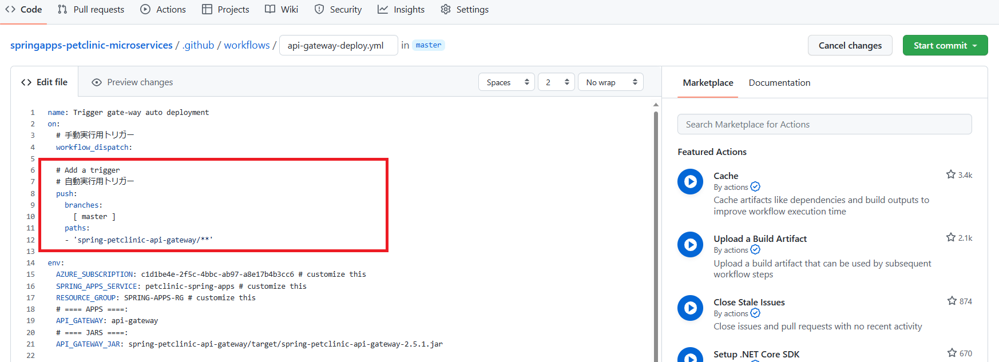
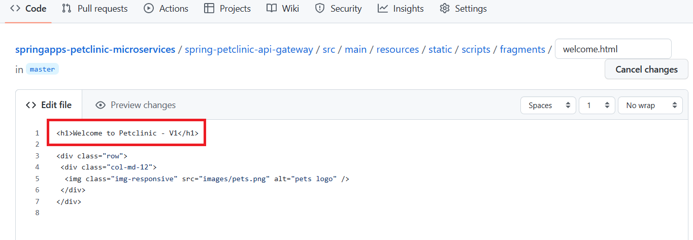
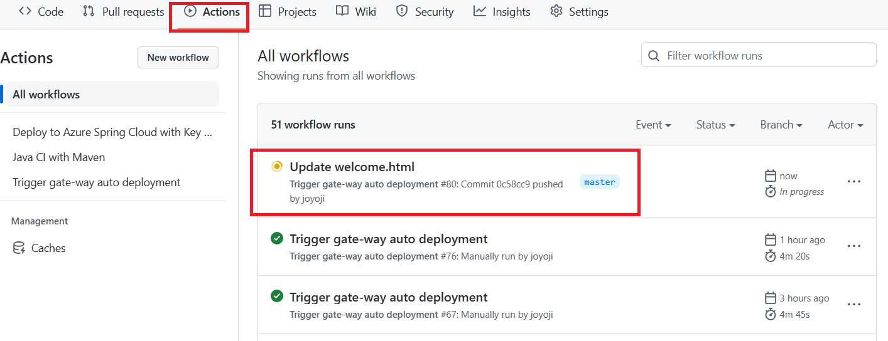
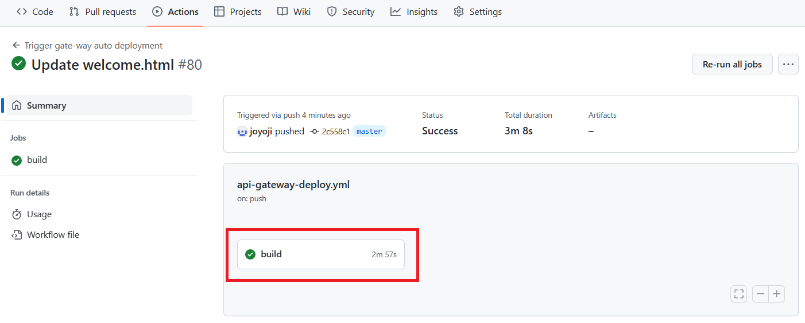
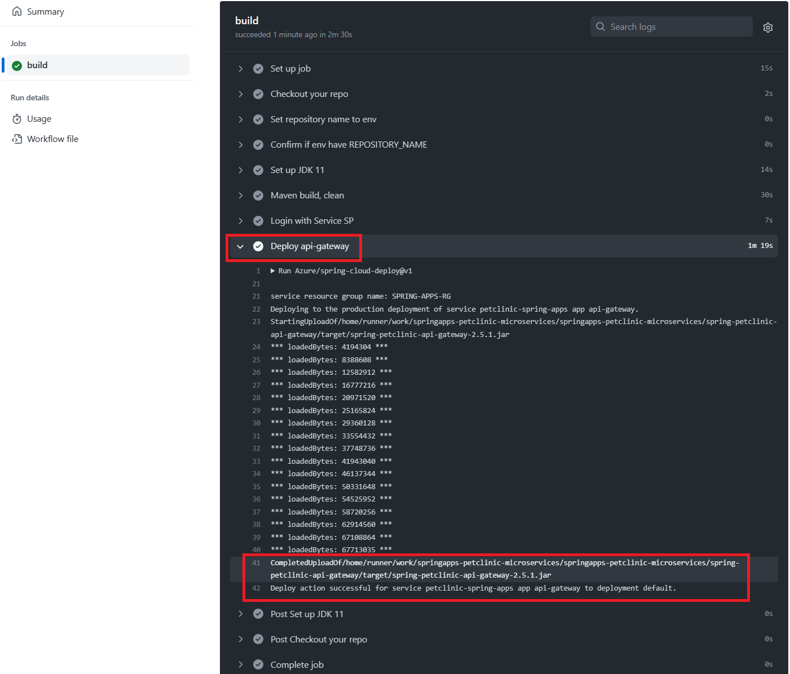
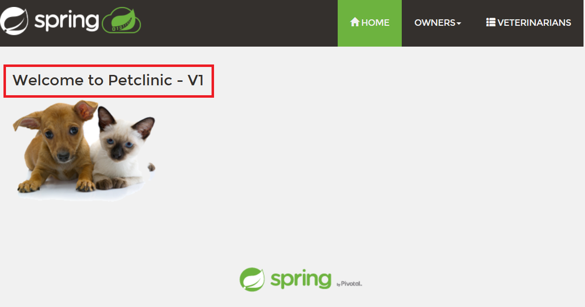

# 演習 2) タスク 5 - CI/CD を体験
ソースコードを修正してリポジトリにコミットすると、ワークフローが自動的に起動され、速やかに修正内容を Spring Apps にデプロイするよう、 GitHub Actions のワークフローへ Trigger 設定を追加します。

> **注:** 演習作業簡略化のため、ファイルの作成と編集は master ブランチに対して直接行います。

## 作業
1. タスク 2 の 1. と同様の手順で、`.github/workflows/api-gateway-deploy.yml` ファイルを編集モードで開きます。

    

2. `.github/workflows/api-gateway-deploy.yml` ファイルの `on` の末尾に自動実行用トリガーの `push` を追加します。
    ```yaml
    name: Trigger auto deployment
    on:
      # 手動実行用トリガー
      workflow_dispatch:
      
      # Add a trigger
      # 自動実行用トリガー
      push:
        branches: 
          [ master ]
        paths:
        - 'spring-petclinic-api-gateway/**'
    ```
    > **注:**  
    > - インデントに注意してください。  
    > - 変更内容は直接 `master` ブランチにコミットしてください。

## 確認
1. 上記 2. の修正が下図赤枠のように `.github/workflows/api-gateway-deploy.yml` ファイルに反映されていることを確認します。
  
    
  
2.  API アプリの リポジトリの `springapps-petclinic-microservices/spring-petclinic-api-gateway/src/main/resources/static/scripts/fragments/welcome.html` を以下のように修正し、`master` ブランチにコミットします。 

    - 修正前: Welcome to Petclinic

    - 修正後: Welcome to Petclinic - V1

    

3. ワークフロー処理が自動的に起動されていることを確認します。実行完了までまちます。緑のアイコンになると、ワークフローを選択します。

    


4. `build` ジョブをクリックします。

    

    各ステップの結果一覧に、`Deploy api-gateway` をクリックします。
    
    ワークフロー処理がエラーなく終了し、下記デプロイ完了のログが出力されたことを確認します。

    `Deploy action successful for service petclinic-spring-apps app api-gateway to deployment default.`

    

5. [**講習 1) タスク 4 - Azure CLI を使用した Azure Spring Apps のデプロイ**](P1-04.md#%E5%8B%95%E4%BD%9C%E7%A2%BA%E8%AA%8D) にメモしておいたアプリの URL にアクセスして、更新したタイトルが表示されていることを確認します。

    

## 参照情報

- <a href="https://learn.microsoft.com/ja-jp/azure/spring-apps/how-to-github-actions?pivots=programming-language-java" target="_blank">GitHub Actions で Azure Spring Apps の CI/CD を使用する</a>

- **GitHub**

    - <a href="https://docs.github.com/en/actions/using-workflows/about-workflows" target="_blank">About workflows</a>
    - <a href="https://docs.github.com/en/actions/using-workflows/triggering-a-workflow" target="_blank">Triggering a workflow</a>
    
---
おめでとうございます！ここで全ての演習が終了となります。

前の手順へ: [**タスク 4 - アプリをデプロイする処理を追加**](P2-04.md)

READMEへ: [**README**](../README.md#%E6%93%8D%E4%BD%9C%E6%89%8B%E9%A0%86)

